# OpsGrid

### AI-Powered Field Operations Intelligence Platform

[](https://nodejs.org/)
[](https://react.dev/)
[](https://www.mongodb.com/)
[](https://socket.io/)
[](https://tailwindcss.com/)
[](https://web.dev/progressive-web-apps/)
[](https://opensource.org/licenses/MIT)

OpsGrid connects dispatchers with distributed field workers through **real-time GPS tracking**, **intelligent task assignment**, **geofencing**, **analytics**, and **AI-generated operational intelligence** — all in a single platform.

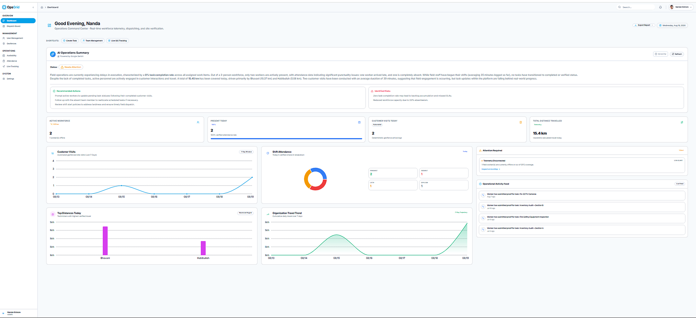

*Admin Dashboard — Real-time operational overview with worker locations, KPI metrics, and active field operations.*

---

## 🎥 Demo

<!-- Add YouTube demo URL -->
<!-- [](https://youtube.com/watch?v=YOUR_VIDEO_ID) -->

> **Demo video coming soon.** Replace the link above with your YouTube demo URL.


---

## ✨ Key Features

| Feature | Description |
|:--------|:------------|
| 🛰 **Real-Time GPS Tracking** | Live worker positions via WebSocket with 5-second throttled updates, battery level, accuracy, and movement detection |
| 🗺 **Interactive Live Map** | Leaflet-powered map with worker markers, GPS trail playback, and directional polyline decorators |
| 📍 **Geofencing Engine** | Polygon and circle geofences with Turf.js point-in-polygon detection, automatic attendance on office entry/exit, and customer visit tracking |
| 📋 **Intelligent Task Dispatch** | Task lifecycle management (unassigned → assigned → in-progress → completed → verified) with nearest-worker detection via geodesic distance |
| 📊 **Kanban Board** | Drag-aware Kanban view for the dispatch board alongside the traditional list view |
| 🤖 **AI Operations Intelligence** | Real-time operational summaries via Groq → Gemini provider cascade with deterministic rule-based fallback |
| 📈 **Analytics Dashboard** | Recharts-powered visualizations: attendance distribution, distance trends, worker performance, and export to PDF/Excel |
| ⏰ **Attendance & Shifts** | GPS/manual/auto check-in/out, shift management with grace periods, overtime calculation |
| 📅 **Worker Availability** | Weekly recurring availability schedules, leave requests (sick/personal/vacation/emergency) with admin approval workflow |
| 🔔 **Real-Time Notifications** | WebSocket-pushed notifications for task assignments, geofence events, attendance, and leave decisions |
| 📱 **Progressive Web App** | Installable mobile experience with offline indicator, service worker caching, and touch-optimized worker UI |
| 🔐 **Role-Based Access Control** | Three roles (Admin, Dispatcher, Worker) with JWT access/refresh token rotation and per-route authorization |
| 📸 **Proof of Completion** | Workers submit geo-tagged photos via Cloudinary with admin verification workflow |
| 🌓 **Dark / Light Theme** | System-aware theme with manual toggle, persisted across sessions |

---

## 📸 Screenshots

### Admin Dashboard


> Real-time KPI cards, worker status overview, active tasks, map with worker markers, and operational metrics.

---

### Live GPS Tracking

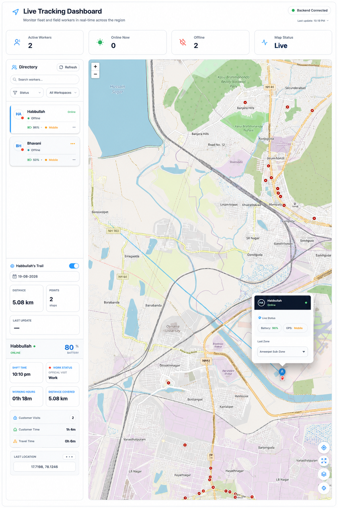

> Live worker map with GPS trail playback, battery/accuracy indicators, worker daily summary cards, and nearest-worker finder.

---

### Task Dispatch

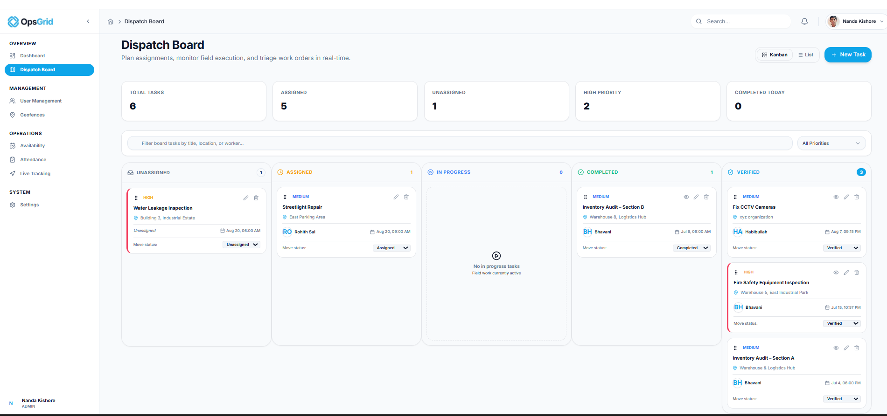

> Task creation with priority, deadline, location coordinates, worker assignment, and Kanban/List view toggle.

---

### Worker Dashboard

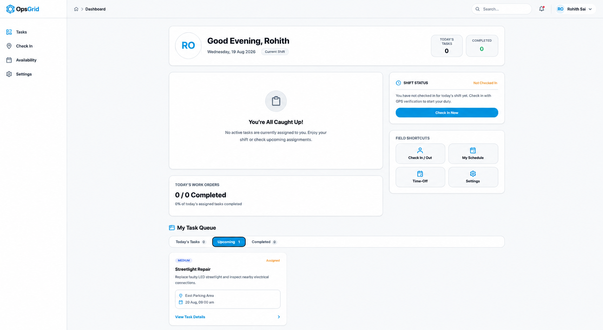

> Worker's assigned tasks, current status, availability, check-in state, and mobile-optimized task actions.

---

### AI Operations Summary

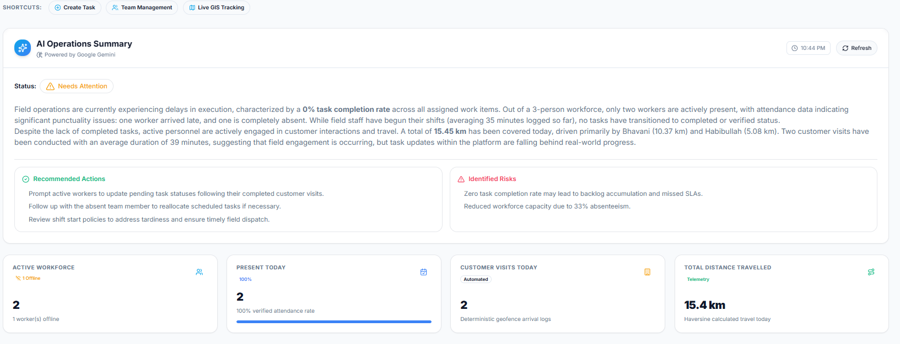

> AI-generated operational health assessment, markdown-formatted insights, actionable recommendations, and identified risks.

---

### Geofence Manager

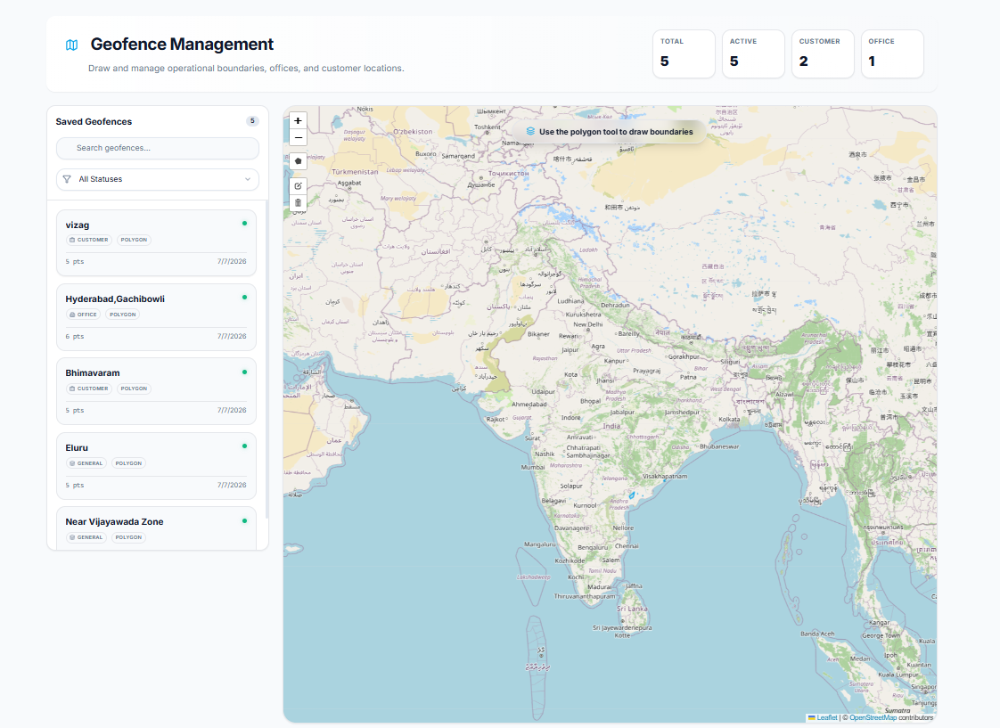

> Interactive map with polygon/circle geofence drawing, category assignment (office/customer/general), and linked task management.

---

### Analytics Dashboard

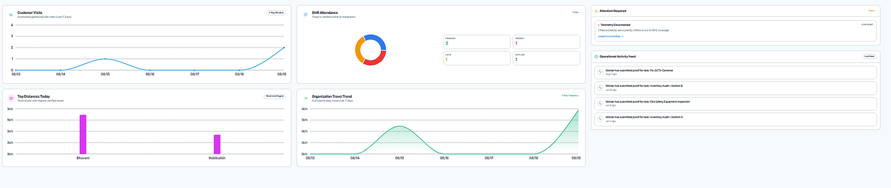

> Attendance distribution charts, 7-day distance trends, top worker distances, and PDF/Excel report export.

---

### Attendance & Availability

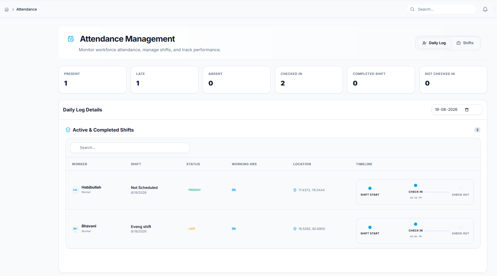

> Attendance log with check-in/out times, shift assignments, leave request management, and worker availability grid.

---

### Task Submission

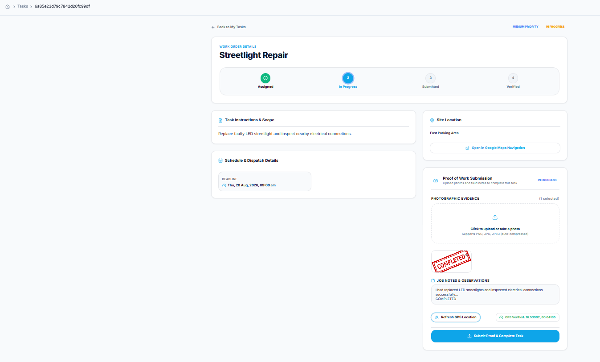

> Worker submitting proof-of-completion with geo-tagged photos, notes, and GPS-verified location.

---

### Mobile PWA


> Installable progressive web app with bottom navigation, touch-optimized controls, and offline detection.

---

## 💡 Why OpsGrid?

Traditional workforce management systems focus on **task tickets, employee records, and manual status updates**. They lack the spatial and temporal awareness that field operations demand.

OpsGrid combines four disciplines into one platform:

```
     Live Telemetry          Task Management
          +                       +
  Geographic Intelligence    AI Analysis
```

| Traditional Systems | OpsGrid |
|:--------------------|:--------|
| Workers self-report status | GPS telemetry streams in real time |
| Dispatchers assign tasks blindly | Nearest-worker finder uses geodesic distance |
| Arrival verified manually | Geofence engine detects enter/exit automatically |
| Reports compiled end-of-day | AI generates operational summaries on demand |
| Desktop-first UI | PWA works on any phone in the field |

---

## 🔍 Problem Statement

Field operations managers face a common set of challenges:

- **No live visibility** into where workers actually are during the day
- **Inefficient task assignment** without proximity or availability context
- **Physical arrival is hard to verify** at customer sites or office locations
- **Distance and travel metrics** require manual calculation or expensive fleet hardware
- **Attendance and availability** data lives in spreadsheets, disconnected from operations
- **End-of-day reporting** is manual, delayed, and subjective

---

## 🛠 Solution

OpsGrid solves these problems through a real-time data pipeline:

```
Worker Device (Browser/PWA)
         │
         ▼
  GPS Telemetry (lat, lng, accuracy, battery)
         │
         ▼
  Socket.IO WebSocket ──── JWT-authenticated
         │
         ▼
  Node.js Backend
         │
    ┌────┼──────────┬──────────────┬──────────┐
    ▼    ▼          ▼              ▼          ▼
 Tracking  Tasks  Geofencing  Attendance  Analytics
    │                                        │
    └────────────────┬───────────────────────┘
                     ▼
           AI Operations Summary
                     │
                     ▼
            Admin Dashboard
```

---

## ⚙️ How OpsGrid Works

1. **Admin provisions workers** — creates accounts with role (admin/dispatcher/worker) and optional shift assignment
2. **Worker authenticates** — JWT access token (15m) + HTTP-only refresh token (7d) with automatic rotation
3. **Worker sends GPS telemetry** — browser Geolocation API → Socket.IO `worker:location-update` every 5 seconds (throttled server-side)
4. **Backend validates movement** — Turf.js calculates Haversine distance; rejects stationary jitter (<5m) and impossible jumps (>150 km/h)
5. **Location is persisted** — valid coordinates are saved to `WorkerLocation` collection and appended to daily `Route` document
6. **Admin monitors in real time** — `location:updated` event broadcasts to admin room; map markers update live
7. **Geofence transitions detected** — Turf.js `booleanPointInPolygon` and circle radius checks trigger enter/exit events with automatic attendance and customer visit tracking
8. **Tasks are assigned and tracked** — full lifecycle from creation → assignment → in-progress → completion → photo proof → admin verification
9. **Analytics aggregate the data** — attendance distribution, distance trends, worker performance scores calculated from GPS trails
10. **AI generates operational intelligence** — real metrics fed to Groq/Gemini with structured JSON response including health rating, recommendations, and risks

---

## 🏗 System Architecture

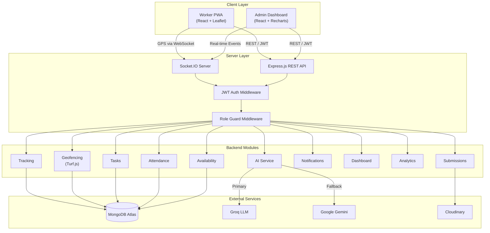

---

## 📦 Core Modules

| Module | Purpose |
|:-------|:--------|
| **Auth** | User registration, login, JWT access/refresh token management, password reset via email (Nodemailer), rate limiting (10 req/15min) |
| **Users** | Profile management, admin user listing, role/status updates, worker roster for dispatchers |
| **Tasks** | Full CRUD with 5-state lifecycle (`unassigned` → `assigned` → `in-progress` → `completed` → `verified`), priority levels, deadline tracking, geospatial coordinates, soft delete |
| **Tracking** | GPS location persistence, active worker aggregation, trail retrieval, nearest-worker search, daily worker summary with performance scoring |
| **Geofencing** | Polygon/circle geofence CRUD, Turf.js-powered enter/exit detection, automatic attendance check-in/out for office zones, customer visit arrival/departure tracking with duration |
| **Attendance** | Daily records with GPS/manual/auto check-in methods, shift assignment, total hours and overtime calculation, late/half-day status |
| **Availability** | Recurring weekly schedules per worker (day + time range), leave requests with type/reason and admin approval workflow |
| **Submissions** | Photo proof-of-completion uploads via Cloudinary signed URLs, geo-tagged submission location, admin verification with feedback |
| **Notifications** | 10 event types including task creation, verification, geofence enter/exit, leave decisions, automatic attendance; real-time via Socket.IO |
| **Dashboard** | Aggregated KPIs (workforce, attendance, customer visits, productivity), chart data (attendance distribution, distance trends, top workers) |
| **Analytics** | Detailed operational summaries, per-worker statistics with distance calculation and performance metrics |
| **AI** | Operations intelligence with Groq → Gemini fallback cascade, structured prompt engineering, in-memory TTL cache, deterministic rule-based fallback |

---

## 🛰 Real-Time Tracking

### GPS Data Pipeline

```
Browser Geolocation API
       │
       ▼
Socket.IO: "worker:location-update"
       │
       ▼
Server-side throttle (1 update / 5 seconds)
       │
       ▼
Zod validation (latitude, longitude, accuracy, battery)
       │
       ▼
Turf.js Haversine distance check
  ├── < 5m → STATIONARY (update lastPing only)
  ├── > 150 km/h → IMPOSSIBLE JUMP (rejected)
  └── Valid movement → SAVE to WorkerLocation
       │
       ▼
User.currentLocation updated
       │
       ▼
Socket.IO: "location:updated" → admin room
       │
       ▼
Geofence transition check (async)
```

### Distance Calculation

OpsGrid uses the **Haversine formula** (via Turf.js `turf.distance()`) for all distance calculations:

- **Real-time validation**: each incoming GPS point is compared against the last known position
- **Trail distance**: sequential Haversine summation across all validated waypoints for a given day
- **Nearest worker**: geodesic distance from target coordinates to all active workers, sorted ascending
- **Speed validation**: distance ÷ time elapsed; points exceeding 150 km/h are rejected as GPS artifacts

### Location Data TTL

`WorkerLocation` documents automatically expire after **7 days** via a MongoDB TTL index, keeping the collection lean.

---

## 📍 Geofencing

### Geofence Types

| Type | Detection Method | Storage |
|:-----|:-----------------|:--------|
| **Polygon** | `turf.booleanPointInPolygon()` | GeoJSON Polygon with 2dsphere index |
| **Circle** | `turf.distance()` ≤ radius (meters) | Center point (GeoJSON Point) + radius |

### Geofence Categories & Actions

| Category | On Enter | On Exit |
|:---------|:---------|:--------|
| **Office** | Automatic attendance check-in | Automatic attendance check-out |
| **Customer** | Customer visit record created with arrival timestamp | Visit closed with departure time and duration |
| **General** | Notification generated | Notification generated |

### Overlap Resolution

When a worker is inside multiple overlapping customer geofences, OpsGrid selects the **smallest-area geofence** to avoid ambiguous visit tracking.

### Real-Time Events

Geofence transitions emit `geofence:entered` and `geofence:exited` Socket.IO events to the admin room with worker ID, geofence name, category, and timestamp.

---

## 🤖 AI Operations Intelligence

OpsGrid generates structured operational summaries by feeding real-time metrics to LLM providers.

### Data Flow

```
Dashboard KPIs + Task Counts + Geofence Stats + Leave Requests
                        │
                        ▼
              Structured Prompt (System + User)
                        │
                        ▼
                ┌── Groq (Primary) ──┐
                │                    │
              Success              Failure
                │                    │
                ▼                    ▼
           Parse JSON         ┌── Gemini (Fallback) ──┐
                │             │                       │
                ▼           Success                 Failure
           Cache (TTL)        │                       │
                │             ▼                       ▼
                ▼        Parse JSON           Rule-Based Fallback
           Return to         │               (deterministic, no LLM)
           Dashboard         ▼                       │
                        Cache (TTL)                  ▼
                             │                  Return to
                             ▼                  Dashboard
                        Return to
                        Dashboard
```

### AI Response Schema

```json
{
  "summary": "2-3 paragraph markdown analysis of operations...",
  "operationalHealth": "Excellent | Good | Needs Attention | Critical",
  "recommendations": ["Actionable recommendation 1", "..."],
  "risks": ["Identified risk 1", "..."]
}
```

### Metrics Fed to AI

Tasks (total, completed, pending, verified), workforce (active/offline), customer visits, average visit duration, attendance (present today, completed shifts, average hours), total distance travelled, geofence counts, pending leave requests, attendance distribution charts, 7-day distance trends, and top worker distances.

---

## 🧰 Technology Stack

### Frontend

| Technology | Version | Purpose |
|:-----------|:--------|:--------|
| React | 18.3 | UI framework with functional components and hooks |
| React Router | 6.28 | Client-side SPA routing with protected routes |
| Tailwind CSS | 3.4 | Utility-first responsive styling with dark mode |
| Vite | 6.0 | Build tool with HMR, proxy, and PWA plugin |
| Leaflet + React Leaflet | 1.9 / 4.2 | Interactive maps with markers, polylines, and draw tools |
| Recharts | 3.9 | Data visualization (pie, bar, area, line charts) |
| Framer Motion | 12.42 | Animations and page transitions |
| Socket.IO Client | 4.8 | Real-time bidirectional WebSocket communication |
| Axios | 1.7 | HTTP client with interceptors for JWT refresh |
| Lucide React | 1.24 | Icon system |
| jsPDF + AutoTable | 4.2 / 5.0 | PDF report generation |
| SheetJS (xlsx) | 0.18 | Multi-sheet Excel workbook export |
| vite-plugin-pwa | 0.21 | Service worker generation and PWA manifest |
| react-markdown | 10.1 | Rendering AI-generated markdown summaries |

### Backend

| Technology | Version | Purpose |
|:-----------|:--------|:--------|
| Node.js | 18+ | JavaScript runtime |
| Express | 4.21 | REST API framework |
| Mongoose | 8.9 | MongoDB ODM with schema validation and indexing |
| Socket.IO | 4.8 | Real-time GPS telemetry and event broadcasting |
| JSON Web Token | 9.0 | Access/refresh token authentication |
| bcryptjs | 2.4 | Password hashing |
| Turf.js | 7.3 | Geospatial calculations (Haversine, point-in-polygon, area) |
| Zod | 3.24 | Request/payload validation |
| Helmet | 8.0 | HTTP security headers |
| CORS | 2.8 | Cross-origin resource sharing with multi-origin support |
| express-rate-limit | 7.4 | Authentication endpoint rate limiting |
| Cloudinary | 2.5 | Image storage for proof-of-completion photos |
| Nodemailer | 9.0 | Password reset emails |
| Groq SDK | 1.3 | Primary AI provider (LLM inference) |
| @google/genai | 2.12 | Fallback AI provider (Gemini) |
| date-fns / date-fns-tz | 4.4 / 3.2 | Date manipulation and timezone handling |
| Morgan | 1.10 | HTTP request logging |

### Infrastructure

| Technology | Purpose |
|:-----------|:--------|
| MongoDB Atlas | Cloud database with geospatial 2dsphere indexes |
| Vercel | Frontend hosting with SPA rewrites |
| Render | Backend hosting with auto-deploy |
| Cloudinary | CDN-backed image storage |

---

## 🔄 Complete Workflow

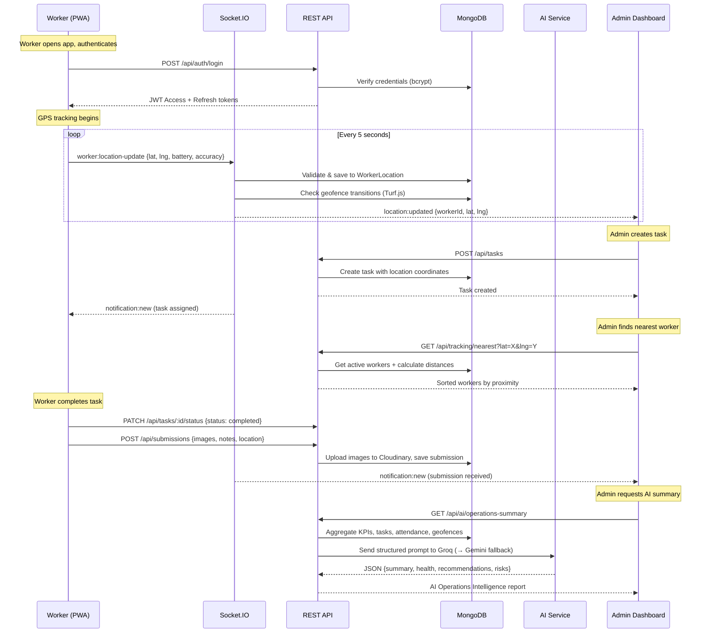

---

## 🗄 Database Architecture

OpsGrid uses **11 MongoDB collections** with geospatial 2dsphere indexes for location queries.

```mermaid
erDiagram
    User ||--o{ AttendanceRecord : "checks in/out"
    User ||--o{ WorkerLocation : "sends GPS"
    User ||--o{ Route : "daily trail"
    User ||--o{ Task : "assigned to"
    User ||--o{ Task : "created by"
    User ||--o{ Submission : "submits proof"
    User ||--o{ WorkerAvailability : "weekly schedule"
    User ||--o{ LeaveRequest : "requests leave"
    User ||--o{ Notification : "receives"
    User ||--o{ CustomerVisit : "visits customer"
    User }o--o| Shift : "assigned shift"
    Task ||--o| Submission : "has proof"
    Geofence ||--o{ CustomerVisit : "tracks visits"
    Geofence ||--o{ Task : "linked tasks"

    User {
        string name
        string email
        string password
        enum role "admin | worker | dispatcher"
        enum status "active | inactive | on-leave"
        GeoJSON currentLocation
        date lastPing
        number batteryLevel
        number accuracy
        ObjectId shiftId
    }

    Task {
        string title
        string description
        enum priority "low | medium | high | urgent"
        date deadline
        string locationAddress
        GeoJSON locationCoordinates
        ObjectId assignedTo
        ObjectId createdBy
        enum status "unassigned | assigned | in-progress | completed | verified"
        boolean isDeleted
    }

    WorkerLocation {
        ObjectId workerId
        GeoJSON location
        number accuracy
        number speed
        number heading
        number batteryLevel
        boolean isMoving
        date timestamp
    }

    Route {
        ObjectId workerId
        date date
        array waypoints
        number totalDistance
        array optimizedOrder
    }

    Geofence {
        string name
        enum type "polygon | circle"
        enum category "office | customer | general"
        GeoJSON boundary
        GeoJSON center
        number radius
        object rules
        boolean isActive
        ObjectId createdBy
    }

    AttendanceRecord {
        ObjectId workerId
        date date
        ObjectId shiftId
        object checkIn
        object checkOut
        number totalHours
        number overtime
        enum status "present | absent | late | half-day | on-leave"
    }

    Shift {
        string name
        string startTime
        string endTime
        number gracePeriodMinutes
        array workers
        boolean isActive
    }

    Submission {
        ObjectId taskId
        ObjectId workerId
        array images
        string notes
        GeoJSON submittedLocation
        boolean isVerified
        ObjectId verifiedBy
        string verificationFeedback
    }

    WorkerAvailability {
        ObjectId workerId
        number dayOfWeek
        string startTime
        string endTime
        boolean isRecurring
        date effectiveFrom
        date effectiveUntil
    }

    LeaveRequest {
        ObjectId workerId
        enum type "sick | personal | vacation | emergency"
        date startDate
        date endDate
        string reason
        enum status "pending | approved | rejected"
        ObjectId approvedBy
    }

    Notification {
        ObjectId userId
        string message
        enum type "task:created | submission:created | task:verified | system | leave_request | leave_approved | leave_rejected | attendance_late | attendance_auto | attendance_override"
        ObjectId relatedTaskId
        boolean isRead
    }

    CustomerVisit {
        ObjectId workerId
        ObjectId geofenceId
        date arrivalTime
        date departureTime
        number durationMs
    }
```

---

## 🌐 API Overview

OpsGrid exposes **44 REST endpoints** across 12 route groups, plus 1 health check.

### Authentication

| Method | Endpoint | Description | Auth |
|:-------|:---------|:------------|:-----|
| `POST` | `/api/auth/register` | Register new user | ⛔ Rate limited |
| `POST` | `/api/auth/login` | Authenticate and receive tokens | ⛔ Rate limited |
| `POST` | `/api/auth/forgot-password` | Request password reset email | ⛔ Rate limited |
| `POST` | `/api/auth/reset-password` | Reset password with token | ⛔ Rate limited |
| `POST` | `/api/auth/refresh-token` | Rotate access token | 🔓 Cookie |
| `GET` | `/api/auth/me` | Get current user profile | 🔐 JWT |

### Users

| Method | Endpoint | Description | Auth |
|:-------|:---------|:------------|:-----|
| `PUT` | `/api/users/me` | Update own profile | 🔐 Any |
| `GET` | `/api/users/workers` | List workers | 🔐 Admin/Dispatcher |
| `GET` | `/api/users` | List all users | 🔐 Admin |
| `PUT` | `/api/users/:id/status` | Update user status | 🔐 Admin |
| `PUT` | `/api/users/:id/role` | Update user role | 🔐 Admin |

### Tasks

| Method | Endpoint | Description | Auth |
|:-------|:---------|:------------|:-----|
| `POST` | `/api/tasks` | Create task | 🔐 Admin/Dispatcher |
| `GET` | `/api/tasks` | List all tasks | 🔐 Admin/Dispatcher |
| `GET` | `/api/tasks/:id` | Get task by ID | 🔐 Admin/Dispatcher |
| `PUT` | `/api/tasks/:id` | Update task | 🔐 Admin/Dispatcher |
| `PATCH` | `/api/tasks/:id/verify` | Verify completed task | 🔐 Admin |
| `DELETE` | `/api/tasks/:id` | Soft-delete task | 🔐 Admin |
| `GET` | `/api/tasks/my-tasks` | Worker's assigned tasks | 🔐 Worker |
| `PATCH` | `/api/tasks/:id/status` | Update task status | 🔐 Worker |

### Tracking

| Method | Endpoint | Description | Auth |
|:-------|:---------|:------------|:-----|
| `POST` | `/api/tracking/location` | Submit GPS location (REST fallback) | 🔐 Worker |
| `GET` | `/api/tracking/active-workers` | Get all active workers with positions | 🔐 Admin/Dispatcher |
| `GET` | `/api/tracking/trail/:workerId` | Get worker's GPS trail for a date | 🔐 Admin/Dispatcher |
| `GET` | `/api/tracking/nearest` | Find nearest workers to coordinates | 🔐 Admin/Dispatcher |
| `GET` | `/api/tracking/daily-summary/:workerId` | Worker daily performance summary | 🔐 Admin/Dispatcher |

### Geofences

| Method | Endpoint | Description | Auth |
|:-------|:---------|:------------|:-----|
| `GET` | `/api/geofences` | List all geofences | 🔐 Admin/Dispatcher |
| `GET` | `/api/geofences/:id` | Get geofence by ID | 🔐 Admin/Dispatcher |
| `POST` | `/api/geofences` | Create geofence | 🔐 Admin |
| `PUT` | `/api/geofences/:id` | Update geofence | 🔐 Admin |
| `DELETE` | `/api/geofences/:id` | Delete geofence | 🔐 Admin |

### Attendance & Shifts

| Method | Endpoint | Description | Auth |
|:-------|:---------|:------------|:-----|
| `POST` | `/api/attendance/check-in` | Manual/GPS check-in | 🔐 Worker |
| `POST` | `/api/attendance/check-out` | Manual/GPS check-out | 🔐 Worker |
| `GET` | `/api/attendance/me` | Worker's own attendance | 🔐 Worker |
| `GET` | `/api/attendance` | All attendance records | 🔐 Admin/Dispatcher |
| `PUT` | `/api/attendance/:id` | Override attendance record | 🔐 Admin |
| `POST` | `/api/shifts` | Create shift | 🔐 Admin |
| `GET` | `/api/shifts` | List shifts | 🔐 Admin |
| `PUT` | `/api/shifts/:id` | Update shift | 🔐 Admin |
| `DELETE` | `/api/shifts/:id` | Delete shift | 🔐 Admin |

### Availability & Leave

| Method | Endpoint | Description | Auth |
|:-------|:---------|:------------|:-----|
| `GET` | `/api/availability/me` | Worker's own availability | 🔐 Worker |
| `PUT` | `/api/availability/me` | Set own availability | 🔐 Worker |
| `GET` | `/api/leave-requests/me` | Worker's leave requests | 🔐 Worker |
| `POST` | `/api/leave-requests` | Submit leave request | 🔐 Worker |
| `GET` | `/api/availability/:workerId` | View worker's availability | 🔐 Admin/Dispatcher |
| `PUT` | `/api/availability/:workerId` | Set worker's availability | 🔐 Admin |
| `GET` | `/api/leave-requests` | All leave requests | 🔐 Admin/Dispatcher |
| `PATCH` | `/api/leave-requests/:id/approve` | Approve/reject leave | 🔐 Admin |

### Other Endpoints

| Method | Endpoint | Description | Auth |
|:-------|:---------|:------------|:-----|
| `GET` | `/api/health` | Server health check | 🔓 Public |
| `GET` | `/api/notifications` | User's notifications | 🔐 Any |
| `PATCH` | `/api/notifications/:id/read` | Mark notification read | 🔐 Any |
| `GET` | `/api/upload/signature` | Cloudinary upload signature | 🔐 Any |
| `POST` | `/api/submissions` | Submit task proof | 🔐 Worker |
| `GET` | `/api/dashboard/analytics` | Dashboard KPIs | 🔐 Admin/Dispatcher |
| `GET` | `/api/dashboard/charts` | Dashboard chart data | 🔐 Admin/Dispatcher |
| `GET` | `/api/analytics/summary` | Operations analytics | 🔐 Admin |
| `GET` | `/api/analytics/worker/:id` | Worker statistics | 🔐 Admin |
| `GET` | `/api/ai/operations-summary` | AI operations intelligence | 🔐 Admin/Dispatcher |

---

## ⚡ Real-Time Events

OpsGrid uses **6 WebSocket events** for live communication.

| Event | Direction | Purpose |
|:------|:----------|:--------|
| `worker:location-update` | Client → Server | Worker sends GPS coordinates with battery, accuracy, timestamp |
| `location:updated` | Server → Admin Room | Broadcast validated worker position to admin/dispatcher dashboards |
| `geofence:entered` | Server → Admin Room | Worker entered a geofence zone (with category and geofence name) |
| `geofence:exited` | Server → Admin Room | Worker left a geofence zone |
| `notification:new` | Server → User Room | New notification pushed to specific user |
| `attendance:auto_checkin` | Server → Manager Room | Automatic attendance triggered by office geofence entry |

---

## 🔐 Security

| Layer | Implementation |
|:------|:---------------|
| **Password Hashing** | bcryptjs with salt rounds |
| **Authentication** | JWT with short-lived access tokens (15m) and HTTP-only refresh tokens (7d) |
| **Token Rotation** | Refresh token stored in user document; rotated on each refresh request |
| **Socket Authentication** | JWT verified on WebSocket handshake via Socket.IO middleware; user identity attached to socket |
| **Role-Based Access** | `requireRoles()` middleware guards every route; 3 roles: `admin`, `dispatcher`, `worker` |
| **Rate Limiting** | Auth endpoints limited to 10 requests per 15-minute window via `express-rate-limit` |
| **Input Validation** | Zod schemas validate all request payloads and GPS data before processing |
| **HTTP Headers** | Helmet.js sets security headers (CSP, HSTS, X-Frame-Options, etc.) |
| **CORS** | Dynamic origin matching with comma-separated allowlist; rejects unknown origins |
| **GPS Integrity** | Server never trusts client-supplied `workerId`; uses authenticated socket identity |
| **Data Expiry** | GPS location documents auto-expire after 7 days via MongoDB TTL index |

---

## 🧠 Engineering Challenges

### 1. GPS Telemetry Validation at Scale

Raw GPS data from browser Geolocation is noisy. Points can jitter by 10–50 meters while a worker stands still, and occasionally teleport across the city due to cell tower handoff.

**Solution**: A three-tier validation pipeline:
- **Stationary filter**: Points within 5 meters of the last known position are classified as jitter and suppressed
- **Speed gate**: Points implying movement faster than 150 km/h are flagged as impossible GPS jumps
- **Server-side throttle**: Only one update per 5 seconds per worker is accepted, preventing flood scenarios

### 2. Overlapping Geofence Resolution

When geofences overlap (e.g., a small customer zone inside a larger general zone), the system must determine which geofence a worker "entered."

**Solution**: All matching geofences are collected, then sorted by area. For customer-category geofences, only the smallest-area match is selected, preventing duplicate visit records.

### 3. AI Provider Resilience

LLM providers can be rate-limited, temporarily unavailable, or return malformed responses.

**Solution**: A three-layer cascade — Groq (primary) → Gemini (fallback) → deterministic rule-based summary (final fallback). The rule-based fallback uses heuristics on completion rate and worker online ratio to generate a structured response without any external API dependency.

### 4. Real-Time State Synchronization

Keeping admin dashboards synchronized with worker positions requires efficient room-based broadcasting without overwhelming network bandwidth.

**Solution**: Socket.IO rooms (`admin`, per-user rooms) ensure events are only sent to relevant clients. GPS updates are throttled server-side, and stationary workers still trigger heartbeat-style broadcasts using their last known position.

### 5. Stale Customer Visit Recovery

If a worker's app disconnects while inside a customer geofence, the visit record has no departure. When the worker re-enters later, the system must close the stale visit correctly.

**Solution**: On re-entry, the system queries `WorkerLocation` for the first GPS ping recorded outside the geofence boundary after the stale visit's arrival time. That timestamp is used as the retroactive departure time.

---

## 📁 Project Structure

```
opsgrid/
├── backend/
│   ├── src/
│   │   ├── config/
│   │   │   ├── db.js                    # MongoDB connection
│   │   │   └── environment.js           # Environment variable parsing
│   │   ├── core/
│   │   │   ├── middlewares/
│   │   │   │   ├── auth.middleware.js    # JWT verification
│   │   │   │   ├── error.middleware.js   # Global error handler
│   │   │   │   └── role.middleware.js    # Role-based access guard
│   │   │   └── utils/
│   │   │       ├── apiError.js           # Standardized error class
│   │   │       ├── apiResponse.js        # Standardized response helper
│   │   │       ├── asyncHandler.js       # Async route wrapper
│   │   │       ├── date.util.js          # Date/timezone helpers
│   │   │       └── distance.util.js      # Haversine + GPS validation
│   │   ├── modules/
│   │   │   ├── ai/                       # AI operations intelligence
│   │   │   │   ├── ai.cache.js
│   │   │   │   ├── ai.controller.js
│   │   │   │   ├── ai.fallback.js
│   │   │   │   ├── ai.prompt.js
│   │   │   │   ├── ai.routes.js
│   │   │   │   ├── ai.service.js
│   │   │   │   └── providers/
│   │   │   │       ├── base.provider.js
│   │   │   │       ├── gemini.provider.js
│   │   │   │       └── groq.provider.js
│   │   │   ├── analytics/               # Operational analytics
│   │   │   ├── attendance/              # Check-in/out + shifts
│   │   │   ├── auth/                    # Registration, login, JWT
│   │   │   ├── availability/            # Weekly schedules + leave
│   │   │   ├── dashboard/               # KPI aggregation + charts
│   │   │   ├── notifications/           # In-app notification system
│   │   │   ├── submissions/             # Proof-of-completion uploads
│   │   │   ├── tasks/                   # Task lifecycle management
│   │   │   ├── tracking/               # GPS, geofencing, routes
│   │   │   │   ├── customerVisit.model.js
│   │   │   │   ├── geofence.controller.js
│   │   │   │   ├── geofence.model.js
│   │   │   │   ├── geofence.routes.js
│   │   │   │   ├── geofence.service.js
│   │   │   │   ├── geofence.validation.js
│   │   │   │   ├── location.model.js
│   │   │   │   ├── route.model.js
│   │   │   │   ├── tracking.controller.js
│   │   │   │   ├── tracking.routes.js
│   │   │   │   ├── tracking.service.js
│   │   │   │   ├── tracking.socket.js
│   │   │   │   └── tracking.validation.js
│   │   │   └── users/                   # User management
│   │   ├── app.js                       # Express app + middleware
│   │   └── server.js                    # HTTP + Socket.IO bootstrap
│   ├── .env.example
│   └── package.json
│
├── frontend/
│   ├── public/                          # PWA icons + favicon
│   ├── src/
│   │   ├── app/
│   │   │   ├── api.js                   # Axios instance + JWT interceptors
│   │   │   ├── auth-context.jsx         # Auth state + token management
│   │   │   ├── socket.js               # Socket.IO client setup
│   │   │   └── theme-context.jsx        # Dark/light theme provider
│   │   ├── assets/branding/             # Logo variants (dark/light)
│   │   ├── common/
│   │   │   ├── components/
│   │   │   │   ├── branding/Logo.jsx    # OpsGrid logo component
│   │   │   │   ├── layout/             # Sidebar, Topbar, Breadcrumbs, MobileBottomNav
│   │   │   │   └── ui/                 # Button, Card, Modal, DataTable, StatCard, etc.
│   │   │   ├── contexts/
│   │   │   │   └── LocationContext.jsx  # Browser Geolocation provider
│   │   │   └── layouts/
│   │   │       ├── AdminLayout.jsx      # Admin/Dispatcher shell
│   │   │       ├── AuthLayout.jsx       # Login/Register shell
│   │   │       └── WorkerLayout.jsx     # Worker mobile shell
│   │   ├── features/
│   │   │   ├── ai/                      # AI Operations Summary panel
│   │   │   ├── analytics/              # Analytics Dashboard + charts
│   │   │   ├── attendance/             # Attendance log + shift manager
│   │   │   ├── auth/                   # Login, Register, Password Reset forms
│   │   │   ├── availability/           # Availability grid + leave request forms
│   │   │   ├── reports/               # PDF + Excel export utilities
│   │   │   ├── submissions/           # Proof submission + admin verification
│   │   │   ├── tasks/                 # TaskForm, TaskList, TaskKanbanView
│   │   │   └── tracking/             # LiveMap, GeofenceEditor
│   │   ├── pages/
│   │   │   ├── admin/                 # AdminDashboard, DispatchBoard, LiveTracking, etc.
│   │   │   ├── landing/              # Public landing page sections
│   │   │   └── worker/               # WorkerDashboard, CheckIn, MyAvailability, TaskDetail
│   │   ├── App.jsx                    # Route definitions
│   │   └── main.jsx                   # App entry point
│   ├── vercel.json                    # SPA rewrite rules
│   ├── vite.config.js                 # Vite + PWA configuration
│   ├── tailwind.config.js             # Theme customization
│   └── package.json
│
├── docs/
│   ├── screenshots/                   # Product screenshots
│   ├── architecture/                  # Architecture diagrams
│   └── demo/                          # Demo recordings
│
├── .gitignore
└── README.md
```

---

## 🚀 Installation

### Prerequisites

- **Node.js** 18+ and npm
- **MongoDB** (local instance or [MongoDB Atlas](https://www.mongodb.com/atlas))
- **Cloudinary** account (for image uploads)
- **Groq** and/or **Google Gemini** API key (for AI features)

### Clone the Repository

```bash
git clone https://github.com/YOUR_USERNAME/opsgrid.git
cd opsgrid
```

### Install Dependencies

```bash
# Backend
cd backend
npm install

# Frontend
cd ../frontend
npm install
```

---

## 🔑 Environment Variables

### Backend (`backend/.env`)

```env
PORT=5000
NODE_ENV=development
MONGO_URI=mongodb://127.0.0.1:27017/opsgrid

JWT_ACCESS_SECRET=your_long_random_access_secret
JWT_REFRESH_SECRET=your_long_random_refresh_secret
ACCESS_TOKEN_EXPIRES_IN=15m
REFRESH_TOKEN_EXPIRES_IN=7d

CLIENT_ORIGIN=http://localhost:5173

CLOUDINARY_CLOUD_NAME=your_cloudinary_cloud_name
CLOUDINARY_API_KEY=your_cloudinary_api_key
CLOUDINARY_API_SECRET=your_cloudinary_api_secret

AI_PROVIDER=gemini
GEMINI_API_KEY=your_gemini_api_key
AI_CACHE_TTL_MINUTES=15
```

### Frontend (`frontend/.env`)

```env
# For local development (uses Vite proxy)
VITE_API_PROXY_TARGET=http://localhost:5000

# For production (direct backend URL)
# VITE_API_URL=https://your-backend.onrender.com
```

> See [`backend/.env.example`](backend/.env.example) and [`frontend/.env.example`](frontend/.env.example) for complete templates.

---

## ▶️ Running Locally

### Start Backend

```bash
cd backend
npm run dev
```

Backend starts on `http://localhost:5000` with Nodemon file watching.

### Start Frontend

```bash
cd frontend
npm run dev
```

Frontend starts on `http://localhost:5173` with Vite HMR. The Vite dev server proxies `/api` requests to the backend automatically.

### Production Build

```bash
cd frontend
npm run build    # Outputs to frontend/dist/
npm run preview  # Preview production build locally
```

---

## ☁️ Deployment

### Frontend → Vercel

| Setting | Value |
|:--------|:------|
| Root Directory | `frontend` |
| Framework Preset | Vite |
| Build Command | `npm run build` |
| Output Directory | `dist` |
| Environment Variables | `VITE_API_URL=https://your-backend.onrender.com` |

SPA routing is configured via [`frontend/vercel.json`](frontend/vercel.json).

### Backend → Render

| Setting | Value |
|:--------|:------|
| Root Directory | `backend` |
| Build Command | `npm install` |
| Start Command | `npm start` |
| Health Check Path | `/api/health` |
| Environment Variables | See [Environment Variables](#-environment-variables) |

> For production CORS, set `CLIENT_ORIGIN=https://opsgrid.vercel.app,http://localhost:5173` on Render.

### Database → MongoDB Atlas

- Create an M0 (free) or dedicated cluster
- Add `0.0.0.0/0` to the IP Access List (or Render's outbound IPs)
- Create a database user with read/write access
- Copy the connection string to `MONGO_URI` on Render

---

## 📊 Project Statistics

| Metric | Count |
|:-------|:------|
| Backend Modules | 11 |
| Database Collections | 11 |
| REST Endpoints | 44 |
| WebSocket Events | 6 |
| AI Providers | 2 + rule-based fallback |
| User Roles | 3 (Admin, Dispatcher, Worker) |
| Frontend Pages | 16 |
| Reusable UI Components | 19 |
| Feature Modules | 9 |

---

## 🔮 Future Scope

- **Push Notifications** — Web Push API for task alerts when the app is closed
- **Offline Sync** — Queue GPS updates and task actions in IndexedDB when offline; sync on reconnect
- **Native Mobile App** — React Native wrapper for background GPS and native sensors
- **Route Optimization** — Suggest optimal task visit order using traveling salesman heuristics
- **Predictive Analytics** — ML models to predict task completion times and worker availability
- **Audit Log** — Immutable trail of all administrative actions for compliance

---

## 🤝 Contributing

1. Fork the repository
2. Create a feature branch (`git checkout -b feature/your-feature`)
3. Commit your changes (`git commit -m 'Add your feature'`)
4. Push to the branch (`git push origin feature/your-feature`)
5. Open a Pull Request

---

## 📄 License

This project is licensed under the MIT License — see the [LICENSE](LICENSE) file for details.

---

## 👨‍💻 Author

**Your Name**

<!-- Replace with your actual links -->
- [GitHub](https://github.com/YOUR_USERNAME)
- [LinkedIn](https://linkedin.com/in/YOUR_PROFILE)

---

**Built with ❤️ for field operations teams everywhere.**

If this project was useful, consider giving it a ⭐
